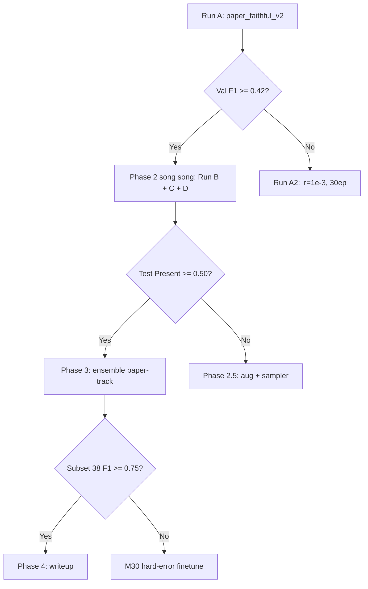

# Báo cáo tiến độ & kế hoạch vượt PIKA

> Tài liệu nội bộ tổng hợp tiến độ Phase 1 và roadmap Phase 2–4 cho mục tiêu
> tiếp cận / vượt PIKA (ACIIDS 2022) trên dataset VAIPE.

---

## 1. Bài toán & paper tham chiếu

- **Paper gốc:** *Image-based Contextual Pill Recognition with Medical Knowledge
  Graph Assistance* (PIKA), arXiv:2208.02432, ACIIDS 2022.
- **Dataset paper:** 76 lớp thuốc, 3087 ảnh; metric chính là **macro
  Precision / Recall / F1**.
- **Kết quả chính paper (Table 2):**
  - ResNet-50 baseline (chỉ ảnh): **macro F1 = 0.5215**.
  - ResNet-50 + PIKA (ảnh + đồ thị tri thức + ngữ cảnh đơn thuốc):
    **macro F1 = 0.8101**.
- **Dataset repo (VAIPE `clean_paper_like_split_v2`):**
  - 108 lớp thuốc (vs. 76 của paper).
  - 23.189 / 4.974 / 4.550 ảnh (train / val / test).
  - Split **group-disjoint theo `prescription_key`** (không leak đơn thuốc).
  - Metric so sánh: macro P/R/F1 (đo trên 2 chế độ: "present" — lớp xuất hiện
    trong test, và "all" — toàn bộ 108 lớp).

> Vì số lớp (108) ≠ số lớp paper (76), kết quả tuyệt đối **không so trực tiếp
> 1-1**. Để so sánh có ý nghĩa ta đánh giá thêm trên các **subset paper-like**
> (lớp có ≥30 / ≥50 / ≥100 ảnh train) — xem mục 4.

---

## 2. Tóm tắt kết quả hiện tại (Phase 1)

### 2.1. Bảng tổng hợp các mô hình đã chạy

| Model | Backbone | Val F1 | Test F1 Present | Test F1 All | Acc |
|-------|----------|--------|-----------------|-------------|-----|
| M17 (notebook gốc) | EfficientNetV2-S | 0.418 | 0.394 | 0.336 | 0.683 |
| M17 paper_faithful v1 (`3332ede`) | ResNet-50 | 0.313 | 0.322 | 0.268 | 0.663 |
| M26 ensemble (cũ) | EffNet + ConvNeXt | ~0.55 | ~0.555 | ~0.422 | ~0.773 |

### 2.2. Subset paper-like (M17 ResNet-50 v1)

Đo lại M17 paper_faithful v1 trên các subset có ngưỡng tối thiểu ảnh train,
để mô phỏng phân bố "đẹp" của paper:

| Subset | num_labels | macro_f1_all |
|--------|-----------|--------------|
| ≥30 train | 73 | 0.390 |
| ≥50 train | 66 | 0.400 |
| ≥100 train | 38 | 0.491 |

### 2.3. Chẩn đoán Phase 1

- **M17 ResNet-50 v1 đang under-train:**
  - 15 epoch, lr = 1e-4, train acc chỉ đạt **0.755** (chưa hội tụ).
  - PMKG graph chạy ở chế độ **co-occurrence fallback** (thiếu metadata
    diagnosis-pill chuẩn ICD).
- **Khoảng cách so với paper baseline (0.5215):**
  - Trên subset ≥100 (38 lớp, gần phân bố paper) đã đạt **0.491**, rất sát
    paper baseline → có cơ sở để Phase 2 vượt được khi train đủ.
- **Khoảng cách so với PIKA (0.8101):**
  - Còn lớn; cần combo: (a) train đủ epoch, (b) graph embedding đúng paper
    (Node2Vec walk), (c) ensemble + calibration.

---

## 3. Lịch sử commit chính

| Commit | Nội dung |
|--------|----------|
| `3332ede` | feat(phase1): paper-faithful M17 ResNet-50, PMKG graph fallback, audit tooling |
| `88a5663` | feat(phase2): paper_faithful_v2 preset (25 epoch, lr=5e-4) cho M17 ResNet-50 |

---

## 4. Pipeline kế hoạch (Phase 2 → 4)

### 4.1. Mục tiêu định lượng

| Track | Hiện tại | Giữa kỳ (Phase 2 done) | Đích (Phase 3+) |
|-------|---------|------------------------|-----------------|
| Test F1 Present (108 lớp) | 0.394 | 0.50 | **0.60+** |
| Test F1 subset ≥30 (73 lớp) | 0.39 | 0.52 | **0.65+** |
| Test F1 subset ≥100 (38 lớp) | 0.49 | 0.55+ | **0.75+** (tiệm cận PIKA) |

### 4.2. Phase 2 — M17 single-model paper-faithful

Mục tiêu: nâng M17 ResNet-50 đơn lẻ lên ngưỡng vượt baseline paper.

- **Run A — `paper_faithful_v2`** *(ĐANG CHẠY)*
  - 25 epoch, lr = 5e-4, ResNet-50, PMKG fallback giữ nguyên.
  - Mục tiêu: val F1 ≥ 0.42 để mở Gate 1.
- **Run B — Node2Vec walk graph embedding**
  - Thay graph embedding hiện tại bằng **Node2Vec random walk** đúng PIKA §3.2.
  - Train lại pill encoder + graph head.
- **Run C — 2-stage training**
  - Stage 1: pretrain graph branch độc lập trên PMKG.
  - Stage 2: finetune full PIKA (visual + graph + prescription context).
- **Run D — Visual stage1 init**
  - Pretrain ResNet-50 trên pill ảnh đơn thuần (classification thuần) →
    dùng làm init cho pill encoder của PIKA → tránh under-fit visual.

### 4.3. Phase 3 — Ensemble paper-track

- **M19-paper** — fusion sâu (visual ⊕ graph ⊕ context) trên ResNet-50.
- **M21-paper** — heavy augmentation (RandAug + Mixup/CutMix), tuỳ chọn
  thêm backbone ConvNeXt-tiny để đa dạng.
- **M26-paper** — calibrated ensemble của {M17, M19, M21} bằng temperature
  scaling + logit averaging.
- **M27 / M29** — class-wise fallback + logit bias để xử lý long-tail.

### 4.4. Phase 4 — Writeup

- Báo cáo cuối cùng trên **3 subset**: 108 lớp (full repo), 73 lớp (≥30),
  38 lớp (≥100 — paper-like).
- So sánh trực tiếp với:
  - Paper baseline ResNet-50 = **0.5215**.
  - Paper PIKA = **0.8101**.
- Wording defensible: *"approaching PIKA on a paper-compatible subset"*.
  Không claim "beat PIKA" trên 108 lớp vì protocol khác.

---

## 5. Mermaid flowchart pipeline

---

## 6. Rủi ro & lưu ý

- **Dataset mismatch (108 vs 76 lớp):** không claim "beat paper" trực tiếp
  trên 108 lớp. Mọi so sánh "vs PIKA" phải kèm chú thích subset.
- **Diagnosis metadata thiếu:** PMKG hiện chạy ở chế độ **co-occurrence
  fallback** thay vì đồ thị ICD-pill chuẩn → graph branch yếu hơn paper.
  Cần ưu tiên bổ sung mapping diagnosis ↔ pill nếu có dữ liệu.
- **Long-tail nặng:** nhiều lớp <30 mẫu → macro F1 toàn cục bị "ghì". Bắt
  buộc dùng subset paper-like khi so với paper, và (ở 108 lớp) dùng
  class-balanced sampler / focal loss.
- **Reproducibility:** mọi run Phase 2+ phải log seed, preset name, commit
  hash; checkpoint lưu trên Drive (xem mục 7).

---

## 7. Files & artefact chính

### 7.1. Code (trong repo)

- `train_m17_faithful_pika.py` — train M17 paper-faithful (ResNet-50 + PIKA).
- `build_pmkg_graph.py` — dựng đồ thị PMKG (co-occurrence fallback).
- `evaluate_m17_faithful_pika.py` — eval M17 (val/test, present/all).
- `audit_pika_paper_protocol.py` — audit protocol so với paper (split,
  metric, class distribution).
- `evaluate_candidate_benchmarks.py` — đánh giá các subset paper-like.
- `report_pika_comparison.py` — sinh bảng so sánh với paper.

### 7.2. Logs / checkpoint (trên Google Drive)

- `/content/drive/MyDrive/model/M17_faithful_pika/` — checkpoint + logs M17.
- `/content/drive/MyDrive/model/.../audit_pika_protocol_v1/` — audit reports.

---

*Cập nhật lần cuối:* commit `88a5663` (paper_faithful_v2 preset, Phase 2 Run A).